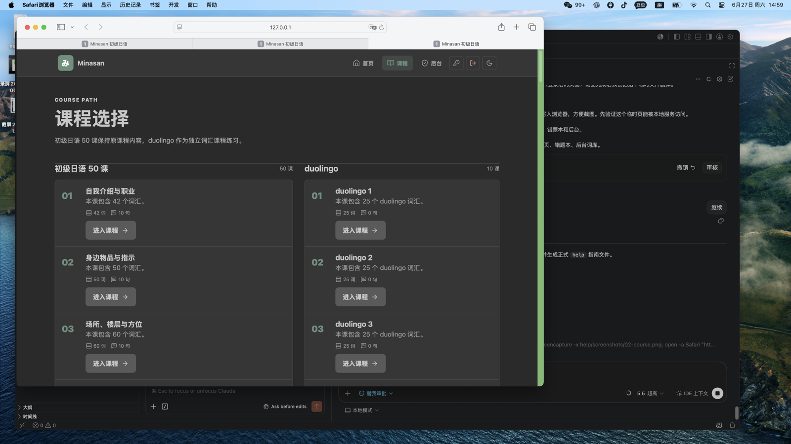
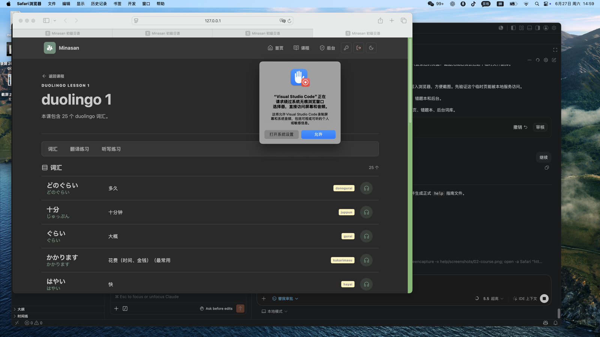
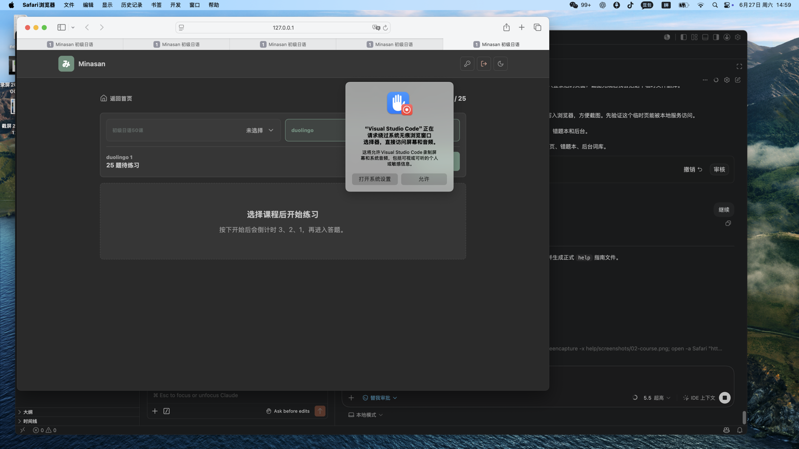
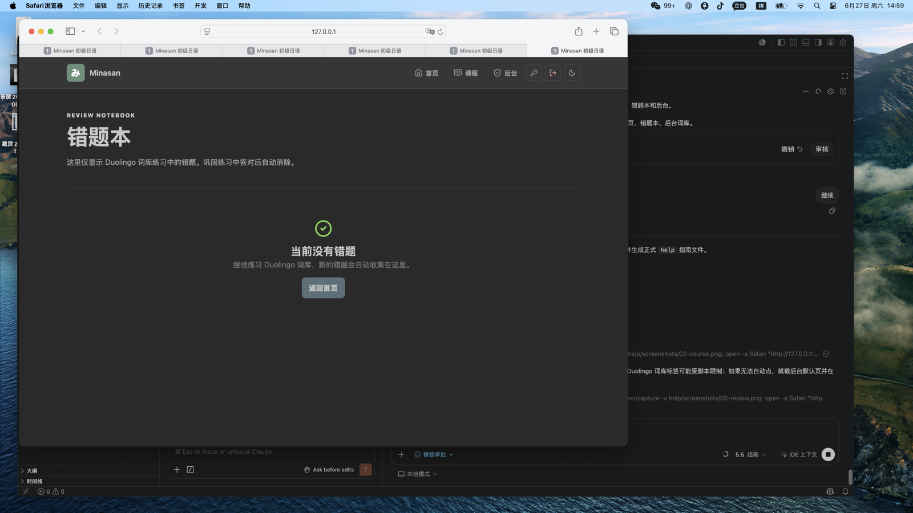
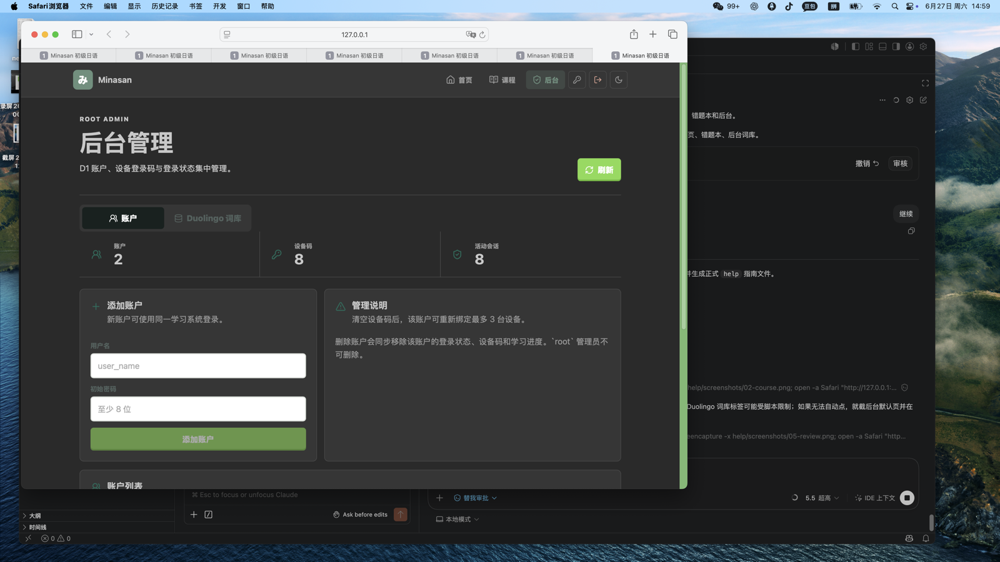

# nihongo 用户操作指南

本指南用于演示 nihongo PWA 的常用操作流程。截图来自本地系统页面。

## 1. 登录与首页

- 打开本地或公网地址后，输入用户名和密码登录。
- 首页顶部可进入首页、课程、后台（root 可见），右上角可修改密码、退出登录、切换护眼模式。
- 首页的 课程词库 进度条可进入已掌握词库。
- 首页的错题本入口只统计 课程词库 词库错题。

## 2. 进入课程

- 点击首页的“继续学习”进入课程页。
- 左侧/上方是系统基础词库，右侧/下方是 课程词库 词汇课程。
- 课程词库 课程点击“进入课程”后，先进入词汇一览学习状态。

## 3. 课程词库 词汇一览

- 词汇一览页展示日文、假名、释义、罗马音和词性。
- 点击耳机按钮可播放发音。
- 可从上方入口进入翻译练习或听写练习。

## 4. 开始练习

- 进入练习页后不会立即开始答题。
- 先选择课程范围，再点击“开始”。
- 点击开始后会显示 3、2、1 倒计时，倒计时结束后进入答题。
- 课程词库 单词首次答对且用时不超过 6 秒，会计入已掌握词汇。
- 答错的 课程词库 单词会进入错题本并同步到 数据库。

## 5. 错题本

- 错题本仅显示 课程词库 词库练习中的错题。
- 默认显示 15 条，支持搜索。
- 点击“开始巩固”进入错题巩固。
- 巩固中答对后，该错题会从错题本移除并同步到 数据库。

## 6. 管理员后台

- root 用户可进入后台。
- 账户页可添加用户、删除用户、清空设备登录码。
- 课程词库 词库页可批量导入词汇、编辑词条、修改课时名称。
- 课时新增使用“第 1 课”到“第 200 课”的选择方式，避免手动填错课时。

## 常用地址

- 本地电脑：`http://127.0.0.1:8788`
- 同 WiFi 手机：`http://192.168.31.120:8788`
- 公网：`http://47.83.169.130`

## 管理员建议流程

1. 先用 root 登录后台。
2. 在“账户”页创建普通用户。
3. 在“课程词库 词库”页确认课时和词汇。
4. 批量新增词汇时，先选择课时，再粘贴日文、假名、罗马音、释义、词性，解析预览后确认写入。
5. 修改单个词汇时，先搜索词条，点击编辑，保存后会同步到用户端。

## 普通用户建议流程

1. 登录账户。
2. 点击首页“继续学习”。
3. 选择 课程词库 课程，先看词汇一览。
4. 进入翻译或听写练习。
5. 选择课程范围，点击开始，倒计时后答题。
6. 练习后查看已掌握词库和错题本。

## 常见问题

- 手机打不开本地地址：确认手机和电脑在同一 WiFi，并使用 `http://192.168.31.120:8788`。
- 修改后台词汇后用户端没更新：用户端返回课程页或刷新页面后会重新读取 数据库。
- 登录提示设备上限：请让 root 在后台清空该用户设备登录码。
- 忘记密码：root 可创建新账户；普通用户可在登录后右上角修改密码。
